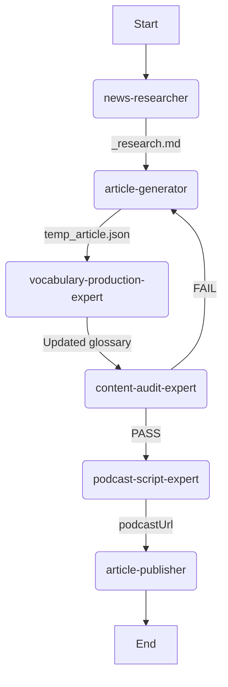

# Content Production Workflow

这是 ReadRead 内容生产的**主入口**。它串联了多个原子 Skill，确保内容生产的流水线化。

## 流程概览 (Pipeline Overview)



---

## 步骤详解 (Step-by-Step)

### Phase 1: Research

**Call `news-researcher`**

- **目标**: 搜索 24h 内新鲜话题，确保无重复。
- **产物**: `src/data/sources/{date}/{slug}_research.md`

### Phase 2: Generation

**Call `article-generator`**

- **输入**: `_research.md`
- **目标**: 撰写 Level 10 文章，生成 JSON。
- **产物**: `temp_article.json` (含 `article` + `glossary` 骨架)

### Phase 3: Vocabulary

**Call `vocabulary-production-expert`**

- **输入**: `temp_article.json`
- **目标**: 完善 `glossary`，更新 `simpleDictionary.ts`。
- **操作**: 修改 `temp_article.json` 中的 `glossary` 字段。

### Phase 4: Audit

**Call `content-audit-expert`**

- **目标**: 100% 词典覆盖、敏感词脱敏、格式规范。
- **操作**: 若失败，返回 Phase 2/3 修改；若通过，继续。

### Phase 5: Podcast

**Call `podcast-script-expert`**

- **输入**: `temp_article.json`
- **目标**: 生成播客脚本 + MP3，更新 `podcastUrl`。

### Phase 6: Publish

**Call `article-publisher`**

- **输入**: 最终 `temp_article.json`
- **目标**: 上传到 PocketBase，清理临时文件。

---

## 数据库映射速查

| PB Field | Source |
| :--- | :--- |
| `date` | `article.meta.date` |
| `level` | `article.meta.level` |
| `topic` | `article.meta.topic` |
| `title_zh` | `article.title.zh` |
| `title_en` | `article.title.en` |
| `intro` | `article.intro` (JSON) |
| `content` | `{ meta, paragraphs }` (JSON) |
| `glossary` | `glossary` (JSON) |
| `podcast_file` | 上传 MP3 文件 |

---

## 常用命令

```bash
# 审计特定日期
node .agent/skills/content-audit-expert/scripts/audit_articles.js --source=pb --date=2026-01-21
node .agent/skills/content-audit-expert/scripts/audit_dictionary.js --source=pb --dict=pb --date=2026-01-21

# 上传文章
node .agent/scripts/upload_article.js temp_article.json

# 上传播客音频
node .agent/scripts/upload_podcast.js <article_id> <path_to_audio.mp3>
```
