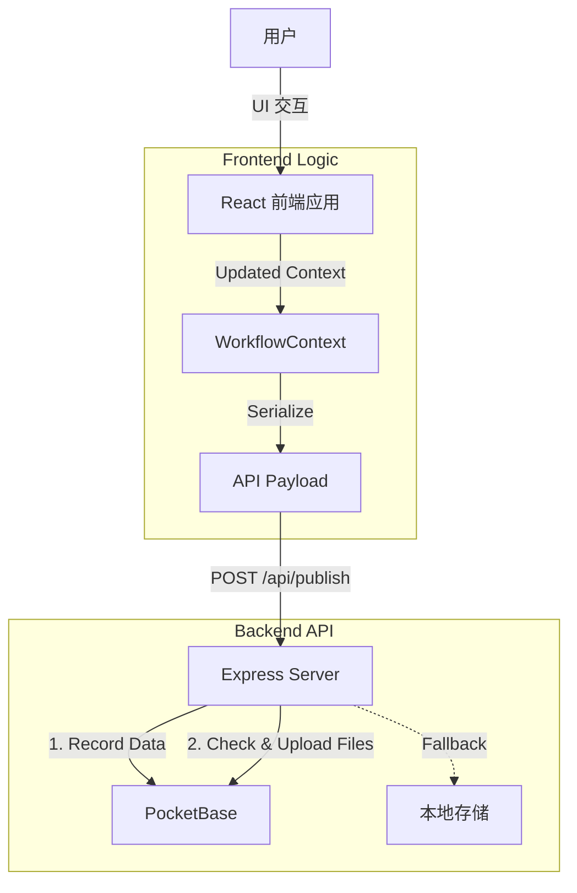

# 内容工作流 (Content Workflow) 项目文档

本文档文件夹 (`readme/`) 包含了理解、维护和扩展本系统的核心知识。

## 📁 文档索引

- **[DEVELOPER_GUIDE.md](./DEVELOPER_GUIDE.md)**: ⭐ **开发者圣经**。包含以下内容：
  - **扩展指南**：如何添加新字段（如视频链接）和文件上传。
  - **核心逻辑**：Session 状态管理、ID 转正机制、大字段 Context Offloading 机制。
  - **Schema 定义**：核心数据结构（文章、单词）的字段字典。
- **[API_REFERENCE.md](./API_REFERENCE.md)**: **API 参考手册**。包含 Backend API 接口说明和 JSON 数据样例。
- **[DATABASE_BROWSER.md](./DATABASE_BROWSER.md)**: 数据库浏览器组件的说明。

## 🏗️ 架构概览

### 技术栈

- **前端**: React, TailwindCSS, Lucide Icons
- **后端**: Node.js (Express), Python (用于 TTS 脚本)
- **数据库**: PocketBase (主要), 本地 JSON 文件 (回退/开发模式)
- **AI 模型**: Gemini Pro/Flash (通过 Google AI Studio API)

### 数据流向图

## 🚀 快速开始

1. **安装依赖**: `npm install`
2. **启动开发服务器**: `npm run dev`
3. **环境配置**: 检查 `.env` 文件配置 (`GEMINI_API_KEY`, `POCKETBASE_URL`)。
